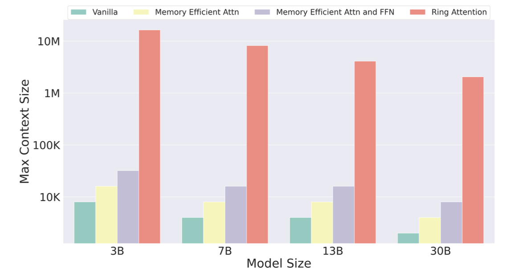

# API-Bank: A Comprehensive Benchmark for Tool-Augmented LLMs

## Description

### Summary

\---

* link: [https://arxiv.org/abs/2304.08244](https://arxiv.org/abs/2304.08244)
* name: API-Bank: A Comprehensive Benchmark for Tool-Augmented LLMs
* code: [https://github.com/AlibabaResearch/DAMO-ConvAI/tree/main/api-bank](https://github.com/AlibabaResearch/DAMO-ConvAI/tree/main/api-bank)

## Introduction

이 논문에서는 세 가지 논제에 대해 답변하는 형식으로 되어 있다.

1. 현재 LLM은 얼마나 tool을 잘 다루는가?(How effective are current LLMs' ability to utilize tools?)\
   \= evaluation system 만듬
2. 어떻게 해만 LLM이 툴을 잘 다루게 할 수 있을까?(How can we enhance LLMs' ability to utilize tools?)\
   \= 학습을 위한 데이터 세트를 만듬(자동으로! Multi-agent)
3. LLM이 툴을 잘 다루기 위해서 해결해야 하는 문제점은 무엇인가?(What obstacles still need to be overcome for LLMs to effectively leverage tools?)

이 해결책들을 다 모은 것이 API-Bank

tool-usage에 대한 user requirements를 얻기 위해 우선 예상 사용자로부터의 interview를 진행. 요구 능력은 다음 세 가지.

* planning
* retrieving
* calling

또한 각 API에 대한 기준치는 다음 세 가지이다.

* domain diversity
* API diversity
* evaluation authenticity

첫 번째 논제에 대한 대답을 위해 evaluation system을 만듬.

## Method

### Design Principles

* 약 500명의 사람들에게 LLM tool use에 대한 인터뷰를 시행
* 해당 답변들을 바탕으로 tool-augmented llm의 requirements 작성

#### Ability Grading

두 개의 기준축을 설정

<figure><figcaption></figcaption></figure>

(1) API pool

* few: api개수가 애초에 적음(BNK? 연산(resoning) / retrieval 정도니까)
  * 이러면 사실 그냥 모든 콜을 진행한 다음에 생성을 해도 무방
* many: api 개수를 많이 사용&#x20;
  * 이러면 모든 콜을 하기에는 예산이 부족하므로 중간에 한 번 걸러 내는 작업 필요.
  * 대신 풀이 넓어서 좀 더 세부적인 정보 얻기 가능

(2) api calls per turn

* 1 call / turn
  * 1 query -> multiple query decomposition
  * query당 api call은 한개
  * 한 쿼리에 대해 한 번만 call search를 진
* multiple calls / turn
  * 그냥 모델이 알아서 step-by-step call을 진행하게 한다.

이를 토대로 4개의 응답 방식이 나오게 되는데, 개발하다보면 few api상태에서는 1 call/turn이나 multiple calls/turn이나 비슷하다는 결론이 나와 그냥 묶어버림. 그리고 남은 세 가지 응답 방식을 define한다.

<figure><figcaption></figcaption></figure>

(1) Call: \[query, \[api1, api2, ..., apiN]] -> apiK

<figure><figcaption></figcaption></figure>

* api목록은 주어진다 (위의 API Description).
* 모델이 할 일은 api중 하나를 골라서 행동을 하는 것.

(2) Retrieval+Call: \[query, ?] -> API

<figure><figcaption></figcaption></figure>

* api목록을 모델에게 알려주지 않음.
* ToolSearcher라는 API에게 현재 필요한 API를 말하도록 함.
* 발견한 API(APIs) 참고하여 답변을 생성함(Call과 동일)

(3) Plan+Retrieval+Call: \[query, ?] -> \[api1, api2, ..., apiN]

<figure><figcaption></figcaption></figure>

* 모델이 생성하는 중에 지속적으로 ToolSearcher를 사용할 수 있음.
* 언제까지? 답변이 나올때까지

## Experiments

## Discussion

* Method-Design Principles에서 인터뷰를 진행할 때 어떻게 했을지를 알고 싶다.
  * 원하는 것 - 원하는 tool 을 말하라고 인터뷰를 진행했는지
  * 원하는 것들을 말하라고 인터뷰를 진행했는지?
  * 위의 것이라면 Design principle에 대한 신뢰도가 있는데, 분석을 통해 Design principle을 정한거면 기준에 대한 내용이 있었으면 좋았을 것.
  * 선호도에 대한 정보가 있으면 더 좋았을수도.&#x20;
  * 사실 사람들 입장에서는 툴을 많이 쓰면 좋냐? 여러 번 되물어보는 게 좋아? 이거보다는 답변을 할 때 추가 설명을 붙이면 좋겠어? 대답하고 답변을 하면 좋겠어? 아니면 json으로 주면 좋겠어? 이걸 더 많이 생각할 것 같다.
    * 사용자 입장에서는 few-many는 아예 관심없을 것 같고 api call은 한 번에 대답해주는 multiple call이 더 편할 것 같다는 생각.
    * 따라서 인터뷰 대상이 일반 사용자가 아니라 이걸 써서 다른 데 적용해보려고 하는 개발자/연구자가 아닐까 하는 생각.
