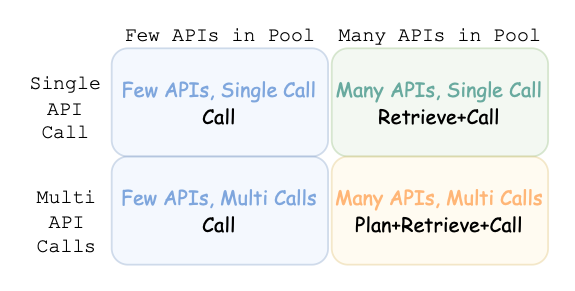

# LongLLaMA: Focused Transformer Training for Context Scaling

## Description

### Summary

* 모델의 입력을&#x20;

***

* name: LongLLaMA: Focused Transformer Training for Context Scaling
* code: [https://github.com/CStanKonrad/long\_llama](https://github.com/CStanKonrad/long\_llama)
  * training - easyLM based :sob:
  * inference - HF OK

## Introduction

모델의 입력을 늘이는 방법에 대한 연구이다. 이 논문에서는 모델의 입력을 늘렸을 때 생기는 가장 큰 문제점을 distraction issue라고 가정하고, 이를 해결하는 방법을 제시하고 있다.

### Distraction Issue

* document의 사이즈가 증가할수록, 문제 해결을 위한 중요한 토큰 / 중요하지 않은 토큰의 비가 급격히 줄어든다.
* 기존 학습법에서는 중요하지 않은 값들과 중요한 값들과 연결된 키들이 겹치는 경우가 많다. 이렇게 되면 모델이 해당 값들을 더 구분하기 어려워진다.

### Proposed Method

contrastive learning

* query와의 관련성을 positive / negative로 두면 contrastive learning과 비슷한 objective를 지니게 된다.
* knn을 통해 (K, V)쌍을 줄여서 attention 연산을 할 수 있게 함.

## Methods

Focused Transformer(FoT)는 크게 두 가지로 이루어져 있다.

memory attention layer는 effective expansion에 관여한다.

CrossBatch training은 모델이 (k, v)에 대해 더 잘 배우도록 돕는다.

### Memory Attention Layer

Memorizing Transformers (ICLR 22, spotlight) 라는 논문에서 주로 아이디어를 가져왔다고 한다.

<figure><figcaption>
Memorizing Transformers architecture. kNN idea came from this
</figcaption></figure>

* 각 레이어의 query가 가장 잘 매치된 top-k key를 가져온다.
  * 가져오는 방식이 kNN (FAISS꺼를 가져왔다)
*

### CrossBatch

## Experiments

## Discussion

